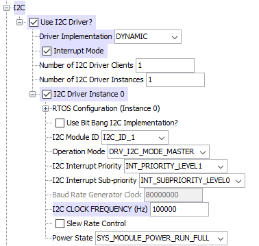

#I2C Example Code

Author: Brian Elliott

##Description
Example showing how to use the dynamic I2C harmony library. This example shows how to setup an instance of the I2C bus, read the status of the I2C, and how to read and write to the slave. 

##Harmony Configuration

##Useful Functions
- Open a I2C instance:
  - Function: `DRV_HANDLE DRV_I2C_Open (const SYS_MODULE_INDEX drvIndex, const DRV_IO_INTENT ioIntent)`
  - Example: `DRV_HANDLE i2cHandle = DRV_I2C_Open (DRV_I2C_INDEX_0, DRV_IO_INTENT_READ | DRV_IO_INTENT_WRITE | DRV_IO_INTENT_NONBLOCKING)`
    - Opens I2C instance 0 to be read/write and non-blocking. The I2C can be accessed using the i2cHandle.

- Create a callback:
  - Function: `void DRV_I2C_BufferEventHandlerSet (const DRV_HANDLE handle, const DRV_I2C_BUFFER_EVENT_HANDLER eventHandler, const uintptr_t context)`
  - Example: `DRV_I2C_BufferEventHandlerSet (i2cHandle, I2C_Callback, NULL)` 
    - Creates a callback called I2C_Callback for i2cHandle.

- Write to the I2C
  - Function: `DRV_I2C_BUFFER_HANDLE DRV_I2C_BufferAddWrite (DRV_HANDLE handle, uint8_t* deviceaddress, void *txBuffer, size_t size, void * context)`
  - Example: `i2cBufferHandle = DRV_I2C_BufferAddWrite(i2cHandle, &(slaveAddress), &(dataBuffer), sizeof(dataBuffer), NULL)`
    - Writes the bytes stored in dataBuffer to the that I2C. Buffers should be arrays of bytes. I2cBufferHandle is a handle for the status buffer of the I2C. This buffer can be read to find out the status of the I2C write. 

- Read from the I2C
  - Function: `DRV_I2C_BUFFER_HANDLE DRV_I2C_BufferAddRead (DRV_HANDLE handle, uint8_t* deviceaddress, void *rxBuffer, size_t size, void * context)`
  - Example: `i2cBufferHandle = DRV_I2C_BufferAddRead(i2cHandle,  &(slaveAddress), &(readBuffer[0]), sizeof(readBuffer), NULL)`
    - Reads bytes from the I2C and stores them into the buffer readBuffer. ReadBuffer is an array of bytes. I2cBufferHandle is a handle for the status buffer of the I2C. This buffer can be read to find out the status of the I2C read.

- Wait until the I2C bus is finished sending/receiving
  - Example: `while(!(DRV_I2C_BufferStatus(i2cBufferHandle) == DRV_I2C_BUFFER_EVENT_COMPLETE ));`
